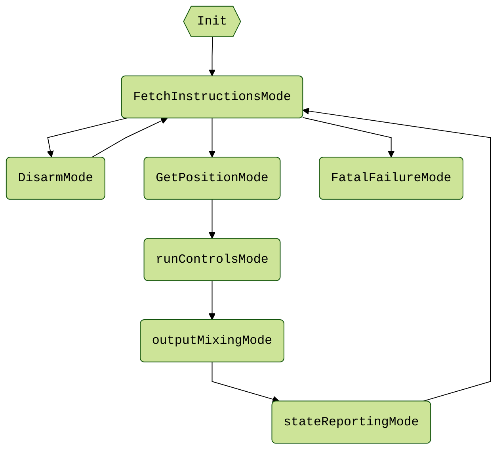

Welcome to Attitude Manager!

```mermaid
%%{
  init: {
    "theme": "forest",
    "fontFamily": "monospace",
    "logLevel": "info",
    "flowchart": {
      "htmlLabels": true,
      "curve": "linear"
    },
    "sequence": {
      "mirrorActors": true
    }
  }
}%%
graph TD;
    init{{Init}}
    fetchInstructions(FetchInstructionsMode)
    disarm(DisarmMode)
    getPosition(GetPositionMode)
    runControls(runControlsMode)
    outputMixing(outputMixingMode)
    report(stateReportingMode)
    ff(FatalFailureMode)

    init-->fetchInstructions;


    fetchInstructions-->getPosition;
    fetchInstructions-->disarm;
    fetchInstructions-->ff;

    disarm-->fetchInstructions;

    getPosition-->runControls;

    runControls-->outputMixing;

    outputMixing-->report;

    report-->fetchInstructions;

```