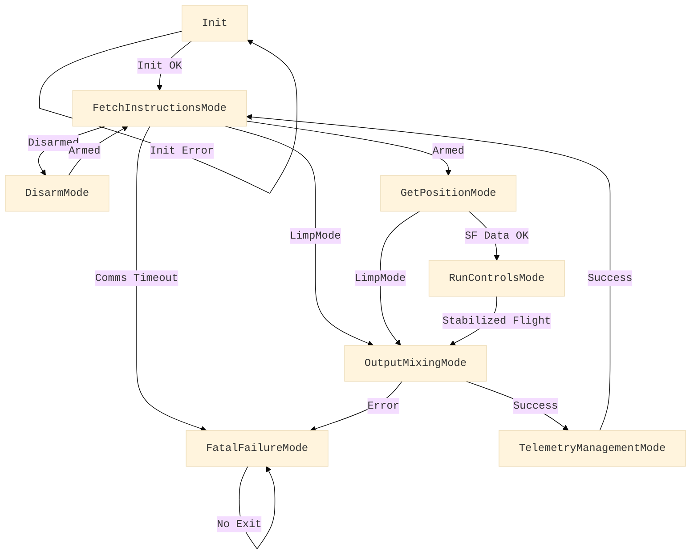

  Welcome to Attitude Manager!

```mermaid
%%{
  init: {
    "theme": "base",
    "fontFamily": "monospace",
    "logLevel": "info",
    "flowchart": {
      "htmlLabels": true
    },
    "sequence": {
      "mirrorActors": true
    }
  }
}%%
graph TD;
  Init--Init Error-->Init
  Init--Init OK-->FetchInstructionsMode
  
  FetchInstructionsMode--Disarmed-->DisarmMode
  FetchInstructionsMode--Comms Timeout-->FatalFailureMode
  FetchInstructionsMode--Armed-->GetPositionMode
  FetchInstructionsMode--LimpMode-->OutputMixingMode
  
  DisarmMode--Armed-->FetchInstructionsMode

  GetPositionMode--SF Data OK-->RunControlsMode
  GetPositionMode--LimpMode-->OutputMixingMode
  
  RunControlsMode--Stabilized Flight-->OutputMixingMode
  
  OutputMixingMode--Success-->TelemetryManagementMode
  OutputMixingMode--Error-->FatalFailureMode
  
  TelemetryManagementMode--Success-->FetchInstructionsMode

  FatalFailureMode--No Exit-->FatalFailureMode
```